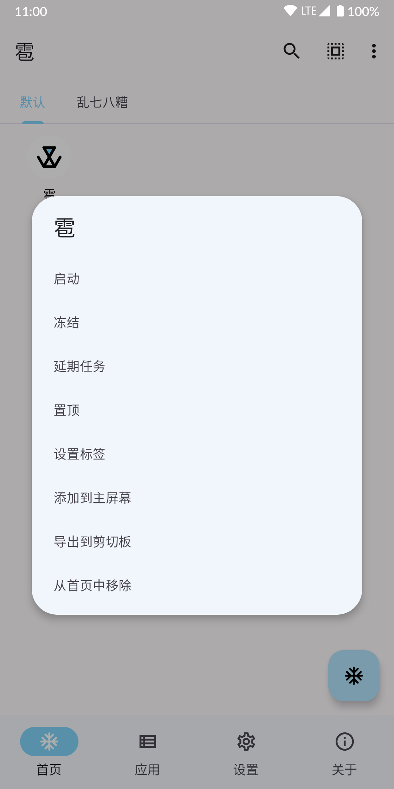
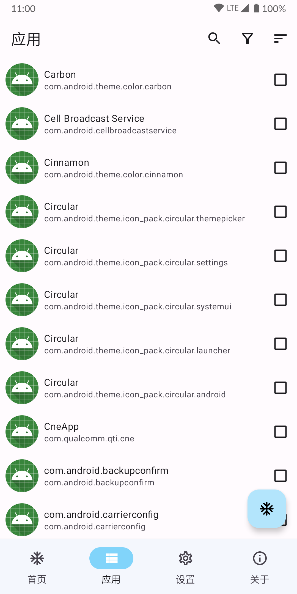
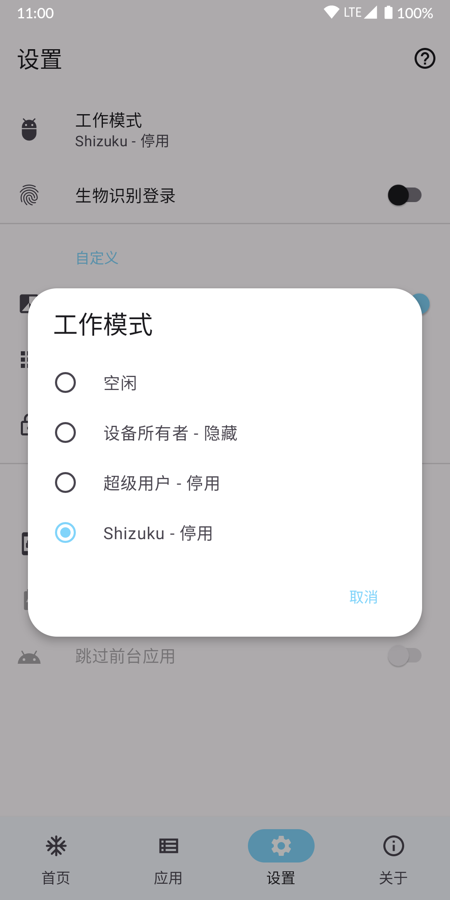

简体中文 | [English](README_EN.md) | [日本語](README_JP.md)

# 雹 Hail

[](https://github.com/aistra0528/Hail/actions)
[](https://hosted.weblate.org/engage/hail/)
[](https://github.com/aistra0528/Hail/releases)
[](LICENSE)

雹是一款用于冻结 Android 应用的自由软件。[GitHub Releases](https://github.com/aistra0528/Hail/releases)

[](https://f-droid.org/packages/com.aistra.hail/)

  

## 冻结

冻结`freeze`是一个营销用语，用于描述使**应用在用户不需要时不可运行**
的行为，以此控制设备使用、减少内存占用和节省电量。用户可在需要时解冻`unfreeze`应用。

在一般情况下，“冻结”是指停用，此外雹也可以通过隐藏和暂停来“冻结”应用。

### 停用

被停用`disable`的应用不会出现在启动器中。在已安装应用列表中会显示已停用`disabled`状态。启用`enable`应用即可恢复。

### 隐藏

被隐藏`hide`的应用不会出现在启动器和已安装应用列表中。取消隐藏`unhide`应用即可恢复。

> 在这种状态下，软件包几乎处于卸载状态，无法使用，但并没有删除数据或实际的软件包文件。

### 暂停 (Android 7.0+)

被暂停`suspend`的应用在启动器中会显示为灰度图标。取消暂停`unsuspend`应用即可恢复。

> 在这种状态下，应用程序的通知将被隐藏，任何启动活动将被停止，不能弹出提示、对话框或播放音频。
> 当用户试图启动一个暂停的应用程序时，系统将向用户显示一个对话框，告知他们在暂停状态下不能使用这个应用程序。

暂停只会阻止用户与应用交互，而**不会**阻止应用在后台运行。

## 工作模式

**冻结的应用需要通过相同工作模式解冻。**

1. 如果您的设备支持无线调试 (Android 11+) 或已 root，推荐选择`Shizuku`。

2. 如果您的设备已 root，可选择`Root`。**此模式速度相对较慢。**

| 授权方式                                                                                           | 强行停止 | 停用 | 隐藏 | 暂停 | 卸载/重新安装（系统应用） |
|------------------------------------------------------------------------------------------------|------|----|----|----|---------------|
| Root                                                                                           | ✓    | ✓  | ✓  | ✓  | ✓             |
| 设备所有者                                                                                          | ✗    | ✗  | ✓  | ✓  | ✗             |
| 特权系统应用                                                                                         | ✓    | ✓  | ✗  | ✗  | ✗             |
| [Shizuku](https://github.com/RikkaApps/Shizuku) (root)/[Sui](https://github.com/RikkaApps/Sui) | ✓    | ✓  | ✓  | ✓  | ✓             |
| [Shizuku](https://github.com/RikkaApps/Shizuku) (adb)                                          | ✓    | ✓  | ✗  | ✓  | ✓             |
| [Dhizuku](https://github.com/iamr0s/Dhizuku)                                                   | ✗    | ✗  | ✓  | ✓  | ✗             |
| [炼妖壶](https://github.com/oasisfeng/island)/[Insular](https://gitlab.com/secure-system/Insular) | ✗    | ✗  | ✓  | ✓  | ✗             |

### 设备所有者

**设置为设备所有者的应用需要移除设备所有者后方可卸载。**

#### 通过 adb 将雹设置为设备所有者

[Android 调试桥 (adb) 指南](https://developer.android.google.cn/studio/command-line/adb)

[下载 Android SDK 平台工具](https://developer.android.google.cn/studio/releases/platform-tools)

通过 adb 发出命令：

```shell
adb shell dpm set-device-owner com.aistra.hail/.receiver.DeviceAdminReceiver
```

设置成功后会输出以下信息：

```
Success: Device owner set to package com.aistra.hail
Active admin set to component {com.aistra.hail/com.aistra.hail.receiver.DeviceAdminReceiver}
```

如输出其他信息，请使用搜索引擎自行查阅与解决。

#### 移除雹的设备所有者

设置 > 移除设备所有者

### 特权系统应用

需要设置特许权限许可名单：

```xml
<?xml version="1.0" encoding="utf-8"?>
<permissions>
    <privapp-permissions package="com.aistra.hail">
        <permission name="android.permission.PACKAGE_USAGE_STATS"/>
        <permission name="android.permission.FORCE_STOP_PACKAGES"/>
        <permission name="android.permission.CHANGE_COMPONENT_ENABLED_STATE"/>
        <permission name="android.permission.MANAGE_APP_OPS_MODES"/>
    </privapp-permissions>
</permissions>
```

并将雹安装为特权系统应用。

推荐方法是在构建 ROM 时导入雹，`Android.bp`配置示例：

```bp
android_app_import {
    name: "Hail",
    apk: "Hail.apk",
    privileged: true,

    dex_preopt: {
        enabled: false,
    },
    presigned: true,
    preprocessed: true,

    required: ["privapp-permissions_com.aistra.hail.xml"]
}

prebuilt_etc {
    name: "privapp-permissions_com.aistra.hail.xml",
    src: "privapp-permissions.xml",
    sub_dir: "permissions",
}
```

## 恢复

### 通过 adb

替换 com.package.name 为目标应用的包名。

```shell
# 启用应用
adb shell pm enable com.package.name
# 取消隐藏应用 (需要 root)
adb shell su -c pm unhide com.package.name
# 取消暂停应用
adb shell pm unsuspend com.package.name
```

### 修改文件

访问`/data/system/users/0/package-restrictions.xml`，此文件存储了应用限制相关信息。您可修改、重命名或直接删除此文件。

- 启用应用：修改`enabled`属性为 2 (DISABLED) 或 3 (DISABLED_USER) 的值为 1 (ENABLED)

- 取消隐藏应用：修改`hidden`属性为 true 的值为 false

- 取消暂停应用：修改`suspended`属性为 true 的值为 false

### 通过恢复模式清除数据 (wipe data)

**希望您能谨慎地选择冻结应用，以免陷入此窘境。**

## API

```shell
adb shell am start -a action -e name value
```

`action`可为：

- `com.aistra.hail.action.LAUNCH`：解冻并启动目标应用。应用未冻结时会直接启动。`name="package"` `value="com.package.name"`

- `com.aistra.hail.action.FREEZE`：冻结目标应用。应用需处于首页。`name="package"` `value="com.package.name"`

- `com.aistra.hail.action.UNFREEZE`：解冻目标应用。`name="package"` `value="com.package.name"`

- `com.aistra.hail.action.FREEZE_TAG`：冻结目标标签中的全部非白名单应用。`name="tag"` `value="标签名"`

- `com.aistra.hail.action.UNFREEZE_TAG`：解冻目标标签中的全部应用。`name="tag"` `value="标签名"`

- `com.aistra.hail.action.FREEZE_ALL`：冻结首页全部应用。无需`extra`。

- `com.aistra.hail.action.UNFREEZE_ALL`：解冻首页全部应用。无需`extra`。

- `com.aistra.hail.action.FREEZE_NON_WHITELISTED`：冻结首页全部非白名单应用。无需`extra`。

- `com.aistra.hail.action.FREEZE_AUTO`：自动冻结首页应用。无需`extra`。

- `com.aistra.hail.action.LOCK`：锁定屏幕。无需`extra`。

- `com.aistra.hail.action.LOCK_FREEZE`：冻结首页全部应用并锁定屏幕。无需`extra`。

## 协助翻译

要将雹翻译成您的语言，或完善现有的翻译，请使用 [Weblate](https://hosted.weblate.org/engage/hail/)。

[](https://hosted.weblate.org/engage/hail/)

## 许可证

    Hail - Freeze Android apps
    Copyright (C) 2021-2024 Aistra
    Copyright (C) 2022-2024 Hail contributors

    This program is free software: you can redistribute it and/or modify
    it under the terms of the GNU General Public License as published by
    the Free Software Foundation, either version 3 of the License, or
    (at your option) any later version.

    This program is distributed in the hope that it will be useful,
    but WITHOUT ANY WARRANTY; without even the implied warranty of
    MERCHANTABILITY or FITNESS FOR A PARTICULAR PURPOSE.  See the
    GNU General Public License for more details.

    You should have received a copy of the GNU General Public License
    along with this program.  If not, see <https://www.gnu.org/licenses/>.
