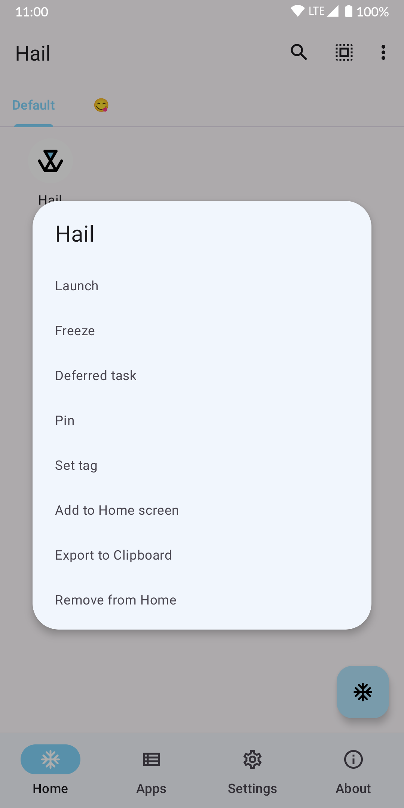
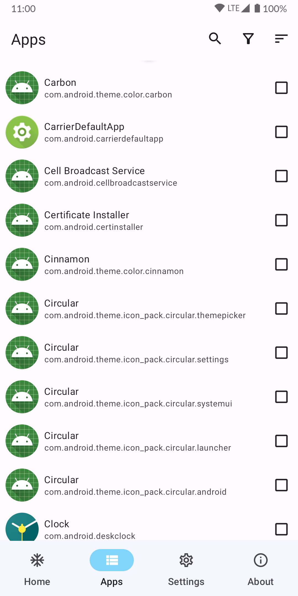
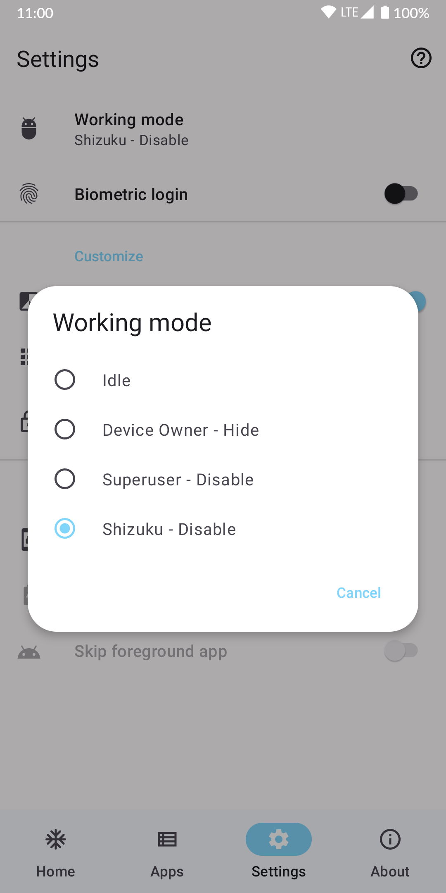

[简体中文](README.md) | English | [日本語](README_JP.md)

# Hail 雹

[](https://github.com/aistra0528/Hail/actions)
[](https://hosted.weblate.org/engage/hail/)
[](https://github.com/aistra0528/Hail/releases)
[](LICENSE)

Hail is a free-as-in-freedom software to freeze Android
apps. [GitHub Releases](https://github.com/aistra0528/Hail/releases)

[](https://f-droid.org/packages/com.aistra.hail/)

  

## Freeze

Freeze is a word that describes the action of **blocking (immediately stopping) apps when they are unnecessary (
on-demand
request)** to use the device
in a better way, cut down on the usage of RAM and save power. Users can also unfreeze them to revert to their original
state.

In general, "freeze" means disable, but also Hail can "freeze" apps by hiding and suspending them.

### Disable

Disabled apps will not be shown in the launcher and will be shown as "Disabled" in the installed apps list. Enable them
to revert the action.

### Hide

Hidden apps will not be shown in the launcher and installed apps list. Unhide them to revert the action.

> While in this state, which is almost like an uninstalled state, the package will be unavailable,
> but the application data and the actual package file will not be removed from the device.

### Suspend (Android 7.0+)

Suspended apps will have their icons shown in a grayscale in the device's launcher. Unsuspend them to revert the action.

> While in this state, the application's notifications will be hidden, any of its started activities
> will be stopped and it will not be able to show toasts, dialogs or even play audio. When the user tries
> to launch a suspended app, the system will, instead, show a dialog to the user informing them that
> they cannot use this app while it is suspended.

Suspend only prevents the user from interacting with the app, it does **NOT** prevent the app from running in the
background.

## Working mode

**Any apps that have been frozen on Hail will need to be unfrozen by the same working mode.**

1. For devices supporting wireless debugging (Android 11+) or rooted devices, `Shizuku` is recommended.

2. For rooted devices, `Root` is an alternative. **It is slower.**

| Privilege                                                                                         | Force Stop | Disable | Hide | Suspend | Uninstall/Reinstall (System Apps) |
|---------------------------------------------------------------------------------------------------|------------|---------|------|---------|-----------------------------------|
| Root                                                                                              | ✓          | ✓       | ✓    | ✓       | ✓                                 |
| Device Owner                                                                                      | ✗          | ✗       | ✓    | ✓       | ✗                                 |
| Privileged System App                                                                             | ✓          | ✓       | ✗    | ✗       | ✗                                 |
| [Shizuku](https://github.com/RikkaApps/Shizuku) (root)/[Sui](https://github.com/RikkaApps/Sui)    | ✓          | ✓       | ✓    | ✓       | ✓                                 |
| [Shizuku](https://github.com/RikkaApps/Shizuku) (adb)                                             | ✓          | ✓       | ✗    | ✓       | ✓                                 |
| [Dhizuku](https://github.com/iamr0s/Dhizuku)                                                      | ✗          | ✗       | ✓    | ✓       | ✗                                 |
| [Island](https://github.com/oasisfeng/island)/[Insular](https://gitlab.com/secure-system/Insular) | ✗          | ✗       | ✓    | ✓       | ✗                                 |

### Device Owner

**You must remove device owner before uninstall**

#### Set device owner by adb

[Android Debug Bridge (adb) Guide](https://developer.android.com/studio/command-line/adb)

[Download Android SDK Platform-Tools](https://developer.android.com/studio/releases/platform-tools)

Issue adb command:

```shell
adb shell dpm set-device-owner com.aistra.hail/.receiver.DeviceAdminReceiver
```

In response, adb prints this message if device owner has been successfully set:

```
Success: Device owner set to package com.aistra.hail
Active admin set to component {com.aistra.hail/com.aistra.hail.receiver.DeviceAdminReceiver}
```

Search the message by search engine otherwise.

#### Remove device owner

Settings > Remove Device Owner

### Privileged System App

The following privapp-permissions is required:

```xml
<?xml version="1.0" encoding="utf-8"?>
<permissions>
    <privapp-permissions package="com.aistra.hail">
        <permission name="android.permission.PACKAGE_USAGE_STATS"/>
        <permission name="android.permission.FORCE_STOP_PACKAGES"/>
        <permission name="android.permission.CHANGE_COMPONENT_ENABLED_STATE"/>
        <permission name="android.permission.MANAGE_APP_OPS_MODES"/>
    </privapp-permissions>
</permissions>
```

To use this mode, you should install Hail as a privileged system app.

The recommended approach is to import Hail when building your ROM, here's an example for `Android.bp`:

```bp
android_app_import {
    name: "Hail",
    apk: "Hail.apk",
    privileged: true,

    dex_preopt: {
        enabled: false,
    },
    presigned: true,
    preprocessed: true,

    required: ["privapp-permissions_com.aistra.hail.xml"]
}

prebuilt_etc {
    name: "privapp-permissions_com.aistra.hail.xml",
    src: "privapp-permissions.xml",
    sub_dir: "permissions",
}
```

## Revert

### By adb

Replace com.package.name to the package name of target app.

```shell
# Enable app
adb shell pm enable com.package.name
# Unhide app (root required)
adb shell su -c pm unhide com.package.name
# Unsuspend app
adb shell pm unsuspend com.package.name
```

### Modify file

Access `/data/system/users/0/package-restrictions.xml`, this file stores the restrictions about
apps. You can modify, rename or just delete it.

- Enable app: Modify the value of `enabled` from 2 (DISABLED) or 3 (DISABLED_USER) to 1 (ENABLED)

- Unhide app: Modify the value of `hidden` from true to false

- Unsuspend app: Modify the value of `suspended` from true to false

### Wipe data by recovery

**None of my business :(**

## API

```shell
adb shell am start -a action -e name value
```

`action` can be one of the following constants:

- `com.aistra.hail.action.LAUNCH`: Unfreeze and launch target app. If it is unfrozen, it will launch
  directly. `name="package"` `value="com.package.name"`

- `com.aistra.hail.action.FREEZE`: Freeze target app. It must be checked at
  Home. `name="package"` `value="com.package.name"`

- `com.aistra.hail.action.UNFREEZE`: Unfreeze target
  app. `name="package"` `value="com.package.name"`

- `com.aistra.hail.action.FREEZE_TAG`: Freeze all non-whitelisted apps in the target
  tag. `name="tag"` `value="Tag name"`

- `com.aistra.hail.action.UNFREEZE_TAG`: Unfreeze all apps in the target
  tag. `name="tag"` `value="Tag name"`

- `com.aistra.hail.action.FREEZE_ALL`: Freeze all apps at Home. `extra` is not necessary.

- `com.aistra.hail.action.UNFREEZE_ALL`: Unfreeze all apps at Home. `extra` is not necessary.

- `com.aistra.hail.action.FREEZE_NON_WHITELISTED`: Freeze all non-whitelisted apps at Home. `extra`
  is not necessary.

- `com.aistra.hail.action.FREEZE_AUTO`: Auto freeze apps at Home. `extra` is not necessary.

- `com.aistra.hail.action.LOCK`: Lock screen. `extra` is not necessary.

- `com.aistra.hail.action.LOCK_FREEZE`: Freeze all apps at Home and lock screen. `extra` is not
  necessary.

## Help Translate

To translate Hail into your language, or to improve an existing translation,
use [Weblate](https://hosted.weblate.org/engage/hail/).

[](https://hosted.weblate.org/engage/hail/)

## License

    Hail - Freeze Android apps
    Copyright (C) 2021-2024 Aistra
    Copyright (C) 2022-2024 Hail contributors

    This program is free software: you can redistribute it and/or modify
    it under the terms of the GNU General Public License as published by
    the Free Software Foundation, either version 3 of the License, or
    (at your option) any later version.

    This program is distributed in the hope that it will be useful,
    but WITHOUT ANY WARRANTY; without even the implied warranty of
    MERCHANTABILITY or FITNESS FOR A PARTICULAR PURPOSE.  See the
    GNU General Public License for more details.

    You should have received a copy of the GNU General Public License
    along with this program.  If not, see <https://www.gnu.org/licenses/>.
